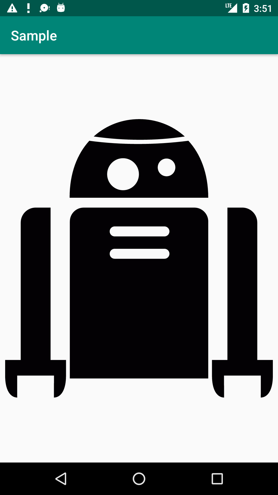
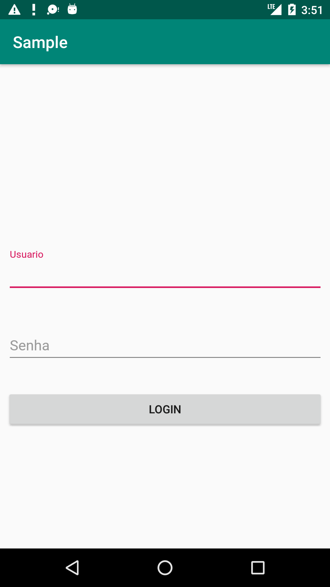
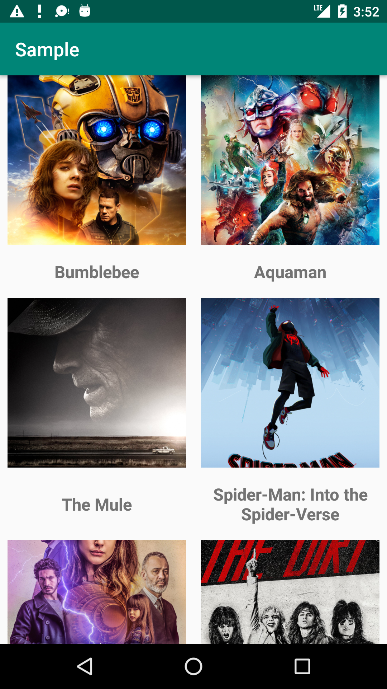

## Projeto teste de Automação

Projeto simples contendo as telas: 
 - splash
 - login 
 - listagem de itens 
 - detalhe do item
 
### O Teste
#### Tarefas a serem realizadas:
 - Criação de BDD do login
 - Elaborar testes automatizados utilizando a ferramenta de sua preferência. Ex.: Appium, Selenium e etc
 - Fazer upload do projeto no repositório público. Ex. Github, Bitbucket, GitLab e etc. 
 
 
### Cenários
  - Splash
    - Ir para tela de Login ou de listagem de items
  - Login
    - Sucesso
    - falha
  - Listagem
    - Selecionar o primeiro
    - Fazer Scroll até o último item da lista e selecionar o mesmo
  - Detalhe
    - Conferir os dados estão sendo apresentados corretamente.
  
OBS.: Não é necessário entregar todas os cenários. Complete o máximo possível. =)
 
 ### Dados para teste 
  - Login:
    - Usuário: user
    - Senha: 123456
  - Aplicativo
    - [APK](app/apk/app-release.apk)

 ### Telas
  
  Tela Splash                               | Tela Login  | Tela Listagem   | Tela Detalhe
  :----------------------------------------:|:---------------------------------------:|:---------------------------------------:|:-------------:
    | | | 

Qualquer dúvida entre em contato 
Boa sorte
 